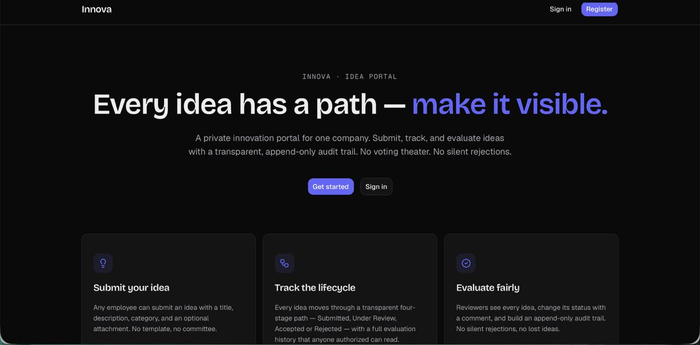
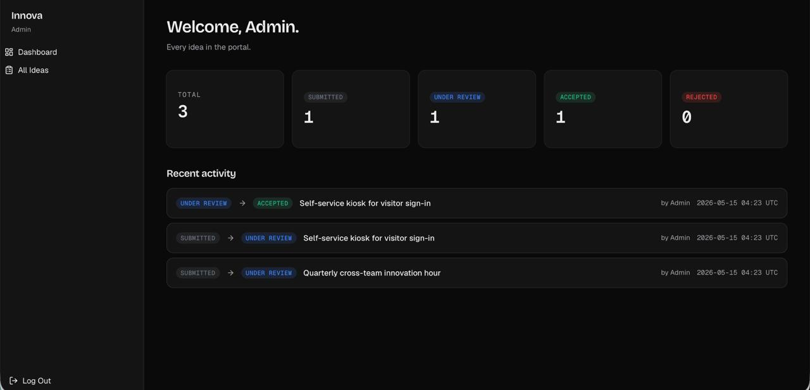
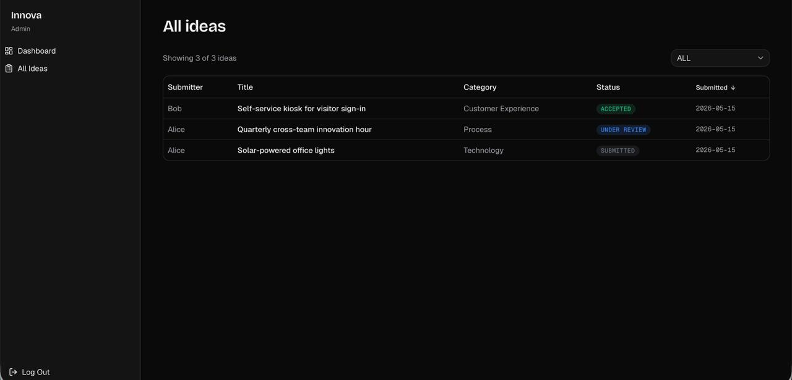

<div align="center">

# 🌌 Innova

### Idea Submission and Evaluation Portal

**EPAM AI-Native Engineering Bootcamp · Diploma Project · May 2026**

<br/>

<p align="center">
  <a href="#-overview"><strong>Overview</strong></a> ·
  <a href="#-tech-stack"><strong>Tech Stack</strong></a> ·
  <a href="#%EF%B8%8F-architecture"><strong>Architecture</strong></a> ·
  <a href="#-setup"><strong>Setup</strong></a> ·
  <a href="#-demo-storyline"><strong>Demo</strong></a> ·
  <a href="#-server-actions"><strong>API</strong></a>
</p>

<br/>


<br/>


</div>

<br/>

---

## 📖 Table of Contents

- [🎯 Overview](#-overview)
- [📋 Bootcamp Requirements](#-bootcamp-requirements)
- [🛠️ Tech Stack](#%EF%B8%8F-tech-stack)
- [✅ Quality Gates](#-quality-gates)
- [🏗️ Architecture](#%EF%B8%8F-architecture)
- [⚠️ Scope and Limitations](#%EF%B8%8F-scope-and-limitations)
- [🚀 Setup](#-setup)
- [🔑 Seeded Accounts](#-seeded-accounts)
- [🎬 Demo Storyline](#-demo-storyline)
- [📡 Server Actions](#-server-actions)
- [📁 Project Layout](#-project-layout)
- [🔧 Development](#-development)
- [🧪 Methodology — Spec Kit](#-methodology--spec-kit)
- [📝 License](#-license)
- [📚 Resources](#-resources)

<br/>

---

## 🎯 Overview

**Innova** is an idea submission and evaluation portal where employees submit improvement ideas and evaluators move them through a defined lifecycle. Dark-mode default. Built and demoed in one night.

The product is deliberately simple — what the diploma evaluates is **methodology adherence**: a constitution that the build is bound by, a spec that drives the plan, a plan that drives a task list, and a task list that drives every commit. Every architectural choice is traceable back to a written principle.

**Two roles:**
- **Submitter** — registers, submits ideas with optional attachments, sees only their own ideas
- **Evaluator (admin)** — sees all ideas, moves them through `Submitted → Under Review → Accepted / Rejected`, appends evaluation comments to an immutable history

This README is the operator-facing setup guide. The deeper artifacts (spec, plan, contracts, tasks) live under `specs/001-idea-portal-mvp/` and are bound by `.specify/memory/constitution.md`.

<br/>

---

## 📋 Bootcamp Requirements

### Core Deliverables

| Requirement | How It's Met |
|---|---|
| Working full-stack web application | Next.js 15 App Router, server actions, SQLite via Prisma |
| Authentication and authorization | Auth.js v5 Credentials + JWT, role-aware middleware |
| Role-based access control | `SUBMITTER` / `EVALUATOR` roles, enforced in middleware + UI + server actions |
| Database with migrations | Prisma 6 + SQLite, migrations under `prisma/migrations/` |
| Test coverage | 27 Vitest unit tests + 1 Playwright critical-path E2E |
| Production build passes | `npm run build` clean, 11 routes compiled, zero type errors |
| Reproducible from clean clone | One-command setup, idempotent seed |

### Methodology Deliverables

| Artifact | Location |
|---|---|
| Constitution (10 principles) | `.specify/memory/constitution.md` |
| Specification (7 user stories, 27 functional requirements) | `specs/001-idea-portal-mvp/spec.md` |
| Clarifications (5 ambiguity resolutions) | `specs/001-idea-portal-mvp/clarify.md` |
| Implementation plan | `specs/001-idea-portal-mvp/plan.md` |
| Task breakdown (58 tasks, 11 phases) | `specs/001-idea-portal-mvp/tasks.md` |

<br/>

---

## 📸 Screenshots

<table>
<tr>
<td width="50%"><br/><sub><b>Landing</b> — dark hero with three staggered feature cards</sub></td>
<td width="50%"><br/><sub><b>Evaluator dashboard</b> — per-status counts plus the recent transition feed</sub></td>
</tr>
<tr>
<td width="50%"><br/><sub><b>All ideas</b> — every idea in the portal, with status badges and submission dates</sub></td>
<td width="50%"><br/><sub><b>Evaluation panel</b> — the append-only audit trail, two transitions visible</sub></td>
</tr>
</table>

<br/>

---

## 🛠️ Tech Stack

| Layer | Choice | Why |
|---|---|---|
| **Runtime** | Node.js 20 LTS | Required by Next.js 15 |
| **Framework** | Next.js 15.5 App Router | Server Actions as the only mutation surface (Principle V) |
| **Language** | TypeScript 5 strict + `noUncheckedIndexedAccess` | Type safety at compile time, not at review time |
| **Auth** | Auth.js v5 Credentials + JWT | Session in the JWT, no DB roundtrip on protected requests |
| **ORM** | Prisma 6 | Migrations, typed client, SQLite for zero-deps demo |
| **Database** | SQLite (`prisma/dev.db`) | Single-file, demoable on any laptop without container infra |
| **UI Kit** | shadcn/ui (`base-nova` preset) + Tailwind v4 | Owned components, no runtime CSS-in-JS |
| **Forms** | react-hook-form + Zod | One schema, validates client and server |
| **Toasts** | sonner | Single source of feedback after mutations |
| **Icons** | lucide-react | Tree-shakable, single icon family |
| **Motion** | Framer Motion | One controlled animation on the landing page; nowhere else |
| **Unit Tests** | Vitest 2 | Pure-logic tests for transitions, file validation, auth helpers |
| **E2E Tests** | Playwright | One critical-path spec (login → submit → evaluate → isolation) |

<br/>

---

## ✅ Quality Gates

Every commit on `main` passed the full gauntlet. Final state at delivery:

| Gate | Command | Result |
|---|---|---|
| Production build | `npm run build` | ✅ 11 routes, 4.5s, zero errors |
| Lint | `npm run lint` | ✅ 0 errors, 0 warnings |
| Type check | `npm run typecheck` | ✅ Clean (`tsc --noEmit`) |
| Unit tests | `npm run test` | ✅ 27/27 passed |
| E2E critical path | `npm run test:e2e` | ✅ 1/1 passed (9s, Chromium) |
| Manual demo walkthrough | 6-step storyline | ✅ All steps verified in browser |

<br/>

---

## 🏗️ Architecture

### Request Flow

```
┌──────────────────────────────────────────────────────────────────┐
│                          Browser (React)                          │
│  Landing · Login · Register · Dashboard · Ideas · Evaluation     │
└──────────────────────────────────────────────────────────────────┘
                              │
                              │  fetch / form submit
                              ▼
┌──────────────────────────────────────────────────────────────────┐
│                  Next.js 15 App Router (RSC)                      │
│                                                                   │
│  ┌────────────────────────────────────────────────────────┐      │
│  │              middleware.ts (Auth.js v5)                 │      │
│  │  - Verify session cookie (JWT)                          │      │
│  │  - Redirect unauthenticated → /login                    │      │
│  │  - Role guard on /dashboard, /ideas/*, /api/attach/*   │      │
│  └────────────────────────────────────────────────────────┘      │
│                              │                                    │
│                              ▼                                    │
│  ┌────────────────────────────────────────────────────────┐      │
│  │           Server Components (read path)                 │      │
│  │  - Pull session via auth()                              │      │
│  │  - Query Prisma directly, role-filtered                 │      │
│  └────────────────────────────────────────────────────────┘      │
│                                                                   │
│  ┌────────────────────────────────────────────────────────┐      │
│  │       Server Actions (only mutation surface)            │      │
│  │  - Zod validation                                       │      │
│  │  - Role check                                           │      │
│  │  - Prisma write + revalidatePath                        │      │
│  └────────────────────────────────────────────────────────┘      │
└──────────────────────────────────────────────────────────────────┘
                              │
                              ▼
┌──────────────────────────────────────────────────────────────────┐
│                      Prisma 6 (typed client)                      │
└──────────────────────────────────────────────────────────────────┘
                              │
                              ▼
┌──────────────────────────────────────────────────────────────────┐
│                      SQLite (prisma/dev.db)                       │
│  Users · Ideas · Evaluations · Attachments (FK + cascade)         │
└──────────────────────────────────────────────────────────────────┘
```

### Components

- **`middleware.ts`** — Route-level auth gate. Runs before any RSC. Reads the Auth.js JWT cookie, attaches the user to the request, blocks unauthenticated traffic on protected paths.
- **`auth.ts`** — Single-file Auth.js v5 config. Credentials provider + JWT strategy. No `PrismaAdapter` (orphan dep). Both `jwt()` and `session()` callbacks carry the `role` claim.
- **`server/actions/`** — Every write goes through here. Server Actions are the only mutation surface. Each action: Zod-validates input → checks role → writes via Prisma → `revalidatePath()`.
- **`lib/auth-helpers.ts`** — `requireUser()` and `requireRole()` for use inside Server Components. Centralizes the "throw on unauthorized" pattern.
- **`lib/file-validation.ts`** — Attachment guard. MIME + extension + size (≤10 MB). PDF / DOC / DOCX only. Files land in `uploads/` (gitignored, outside `public/`); access goes through `/api/attachments/[id]` with a role check (FR-014: audience-mirroring).

<br/>

---

## ⚠️ Scope and Limitations

Transparency matters. The following constraints are intentional and called out so reviewers don't read them as oversights.

### Data Limitations
- **SQLite, single-file.** Fine for a demo, not for concurrent production load. Postgres would be a one-line schema change.
- **No soft-delete.** Ideas, once submitted, are read-only (FR-019). Hard-delete is not exposed in the UI.
- **Attachments on disk.** `uploads/` is a local folder. Production would put these in S3 / Azure Blob.

### Auth Limitations
- **No email verification, no password reset.** Bootcamp scope deliberately excluded these. Auth.js v5 supports both, the wiring is the work — not the design.
- **JWT in cookie.** No refresh token rotation. Acceptable for a demo session length.
- **No rate limiting on `/api/auth/*`.** Production would add upstash-ratelimit or similar.

### Scope Limitations
- **No notifications.** Status transitions don't email the submitter. Out of scope.
- **No search.** Ideas list is sortable but not searchable. Out of scope.
- **No file preview.** Attachments download, they don't render inline. Out of scope.
- **Single locale.** UI is English-only.

### Testing Limitations
- **One Playwright spec.** Critical path only — login → submit → evaluate → isolation. Other flows are covered by unit tests on the underlying logic, not by E2E.
- **No visual regression tests.** Out of scope.
- **No load tests.** Out of scope.

<br/>

---

## 🚀 Setup

### Prerequisites

- **Node.js 20 LTS or newer** (`node --version` should print `v20.x` or higher)
- **npm 10+** (ships with Node 20)
- **Git**
- **~500 MB free disk space** (node_modules + Prisma engines + Playwright browsers)

### Step by Step

```bash
# 1. Clone the repo
git clone https://github.com/muratcan-ates/innova.git
cd innova

# 2. Copy the environment template
cp .env.example .env
# Default values work for local demo — no edits needed

# 3. Install dependencies (~1-2 min on first run)
npm install

# 4. Reset and seed the database
npm run db:reset
# Creates ./prisma/dev.db, runs all migrations,
# seeds 3 users + 3 ideas (with evaluation history)

# 5. Start the dev server
npm run dev

# 6. Open in browser:
#    http://localhost:3000
```

Log in with one of the [seeded accounts](#-seeded-accounts) below.

### Optional: Run the test suite

```bash
# Unit tests (Vitest, ~3 sec)
npm run test

# E2E critical path (Playwright, ~9 sec, requires browsers installed once)
npx playwright install chromium  # first time only
npm run test:e2e

# Full quality gauntlet (build + lint + typecheck + unit + e2e)
npm run build && npm run lint && npm run typecheck && npm run test && npm run test:e2e
```

### Optional: Production build

```bash
npm run build       # type-checks, lints, and bundles
npm run start       # serves the production build on http://localhost:3000
```

<br/>

---

## 🔑 Seeded Accounts

| Role | Email | Password |
|---|---|---|
| Evaluator (admin) | `admin@innova.local` | `admin123` |
| Submitter | `alice@innova.local` | `alice123` |
| Submitter | `bob@innova.local` | `bob123` |

**These credentials are demo-only.** They live in `prisma/seed.ts` in plain text on purpose so a non-coder operator can show them to the jury without copy-pasting from a vault. They are NOT a production pattern.

### Seeded Ideas

| Submitter | Title | Status |
|---|---|---|
| Alice | Solar-powered office lights | Submitted |
| Alice | Quarterly cross-team innovation hour | Under Review |
| Bob | Self-service kiosk for visitor sign-in | Accepted |

The "Under Review" and "Accepted" ideas each have admin-written evaluation entries in their history, so the timeline is non-empty in the demo.

<br/>

---

## 🎬 Demo 

The full walkthrough:

1. **Landing page** (`http://localhost:3000`) — dark hero, three feature cards stagger in, **Sign In** and **Register** CTAs.
2. **Register a Submitter live** — name + email + password + role (default Submitter). After submit, land on the Dashboard with all-zero stat tiles and a "Submit your first idea" CTA.
3. **Submit an idea** — title + description + category, optional PDF/DOC/DOCX (≤10 MB). After submit, land on `/ideas/<id>` with a gray "Submitted" badge.
4. **Switch users to admin** — sign out, sign in as `admin@innova.local` / `admin123`. Evaluator dashboard shows total + per-status counts + Recent Activity.
5. **Walk the lifecycle** — open the new idea, move `Submitted → Under Review` (badge turns blue), then `Under Review → Accepted` with a one-line comment (badge turns green). Timeline grows by two rows with timestamps and the admin's name.
6. **Demonstrate isolation** — log out, sign in as Bob, paste Alice's idea URL into the address bar → 404. Same for the attachment URL.

<br/>

---

## 📡 Server Actions

All mutations go through Server Actions. There is no REST or GraphQL surface.

| Action | File | Role | Purpose |
|---|---|---|---|
| `registerUser` | `server/actions/auth.ts` | _public_ | Create a Submitter account |
| `submitIdea` | `server/actions/ideas.ts` | `SUBMITTER` | Create an idea + optional attachment |
| `updateIdeaStatus` | `server/actions/ideas.ts` | `EVALUATOR` | Transition status + append evaluation comment |

### Read Routes

| Path | Component | Role | What it shows |
|---|---|---|---|
| `/` | Server Component | _public_ | Landing page |
| `/login`, `/register` | Server Component | _public_ | Auth forms |
| `/dashboard` | Server Component | both | Role-aware stat cards + Recent Activity |
| `/ideas/submit` | Server Component | `SUBMITTER` | Submission form |
| `/ideas/mine` | Server Component | `SUBMITTER` | Submitter's own ideas |
| `/ideas` | Server Component | `EVALUATOR` | All ideas (data table) |
| `/ideas/[id]` | Server Component | both * | Idea detail + evaluation panel |
| `/api/attachments/[id]` | Route Handler | both * | Streams the attachment file |

\* _Audience-mirroring (FR-014): a Submitter can only see their own idea; an Evaluator can see any._

<br/>

---

## 📁 Project Layout

```
innova/
├── app/                          # Next.js App Router
│   ├── (public)/                 # Landing / login / register (no sidebar)
│   ├── (app)/                    # Dashboard / ideas/* (with sidebar)
│   └── api/                      # Auth catch-all + attachment download
├── components/                   # UI components + shadcn primitives in components/ui/
├── lib/                          # Prisma client, auth helpers, validation, logger
├── server/actions/               # Server Actions (the only mutation surface)
├── prisma/
│   ├── schema.prisma             # Single source of truth for the data model
│   ├── migrations/               # Generated SQL migrations
│   ├── seed.ts                   # Idempotent seed (3 users + 3 ideas)
│   └── dev.db                    # SQLite database (gitignored)
├── uploads/                      # Attachment files (gitignored, outside public/)
├── tests/unit/                   # Vitest tests (pure logic only)
├── e2e/                          # Playwright critical-path spec
├── specs/001-idea-portal-mvp/    # Spec, plan, contracts, tasks, research
├── .specify/memory/              # Constitution
├── auth.ts                       # Auth.js v5 config
├── middleware.ts                 # Route protection
└── README.md                     # You are here
```

<br/>

---

## 🔧 Development

### Branch Strategy

- `main` — every commit on `main` passes the full gauntlet. No exceptions.
- Feature branches — anything in progress. Squash-merged into `main`.

### Commit Convention

[Conventional Commits](https://www.conventionalcommits.org/) — enforced by Constitution Principle IX.

- `feat:` — new capability
- `fix:` — bug fix
- `refactor:` — structural change, no behavior change
- `docs:` — documentation only
- `chore:` — tooling / config / housekeeping
- `test:` — adding or adjusting tests

### NPM Scripts

| Script | What it does |
|---|---|
| `npm run dev` | Next.js dev server on `http://localhost:3000` |
| `npm run build` | Production build. Type-checks and lints as part of the build. |
| `npm run start` | Serves the production build (after `npm run build`) |
| `npm run lint` | `next lint` |
| `npm run typecheck` | `tsc --noEmit` |
| `npm run test` | Vitest — runs the unit tests under `tests/unit/` |
| `npm run test:e2e` | Playwright — runs the critical-path spec under `e2e/` (Chromium only) |
| `npm run seed` | Runs `prisma/seed.ts` against the existing DB. Idempotent. |
| `npm run db:reset` | **Wipes and recreates** the SQLite DB, runs migrations, then seeds. The "I want a fresh demo" button. |

<br/>

---

## 🧪 Methodology — Spec Kit

This project was built with [**GitHub Spec Kit**](https://github.com/github/spec-kit) — a specification-first workflow where the build is bound to written artifacts at every layer.

### The Five Phases

1. **Constitution** — Ten non-negotiable principles. Set before any code is written. Anything that violates a principle requires an amendment, not a workaround.
2. **Specification** — The product as user stories and functional requirements. Independent of stack.
3. **Clarification** — Ambiguities in the spec, resolved as explicit Q&A. Five clarifications were needed for this build.
4. **Plan** — The technical strategy. Pins the stack, defines data model, sketches contracts.
5. **Tasks** — The plan, atomized. Fifty-eight tasks across eleven phases. Each task is one commit.

Every commit message references the task ID it implements (e.g. `feat(auth): US-1 registration page + Server Action (T034)`). This makes the build auditable: any line of code traces back through a task → a plan section → a spec FR → a principle.

### Build Notes

- **Built solo in one overnight session** using GitHub Spec Kit, Claude Code, and the orchestrator-operator pattern (operator decides architecture, agent writes code).
- **Five course corrections were taken on the fly** — Next.js 16 pinned back to 15, shadcn `new-york` preset replaced with `base-nova`, Prisma 7 downgraded to 6, a `.next` cache corruption traced to a `build`/`dev` race, and a Playwright/dev-overlay collision resolved by disabling the dev overlay rather than forcing the click. Each one is documented in the commit history.

<br/>

---

## 📝 License

MIT — see `LICENSE` for the full text. The seeded credentials are not covered by this license; they are clearly marked as demo-only.

<br/>

---

## 📚 Resources

### Methodology
- [GitHub Spec Kit](https://github.com/github/spec-kit)
- [Conventional Commits](https://www.conventionalcommits.org/)

### Stack Documentation
- [Next.js 15 App Router](https://nextjs.org/docs/app)
- [Auth.js v5](https://authjs.dev/)
- [Prisma 6](https://www.prisma.io/docs)
- [shadcn/ui](https://ui.shadcn.com/)
- [Tailwind CSS v4](https://tailwindcss.com/)

### Inspiration
- EPAM's internal innovation submission platform (referenced as the product brief, not the codebase)

<br/>

<div align="center">

**Built with GitHub Spec Kit + Claude Code · May 2026**

</div>
