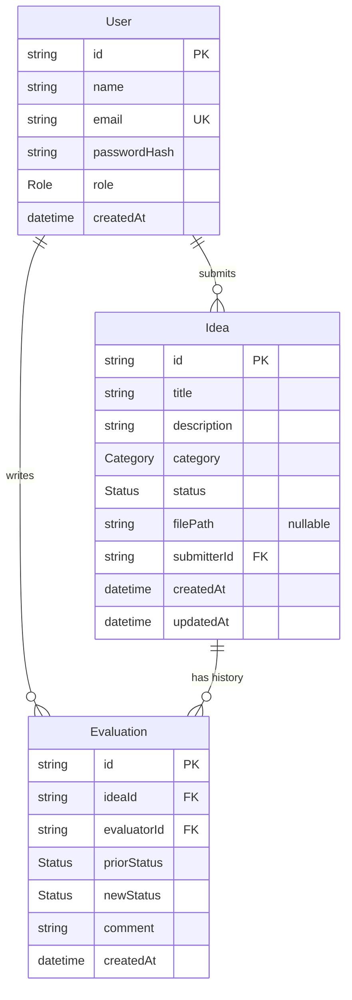
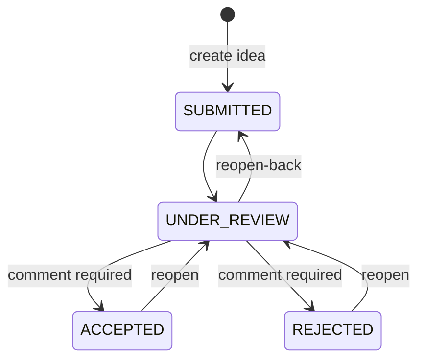

# Data Model: Innova MVP

**Phase**: 1
**Date**: 2026-05-14
**Persistence**: SQLite at `./prisma/dev.db`
**Schema source**: `prisma/schema.prisma`

This document captures the three entities the spec calls out (User, Idea,
Evaluation Event) and the relationships among them, expressed both as a
Prisma schema and as a Mermaid ER diagram so a non-technical reviewer can
read either.

## Plain-English Overview

- A **User** is anyone who has registered. Two kinds exist: **SUBMITTER**
  and **EVALUATOR**. The role lives on the user row.
- An **Idea** is a proposal that a Submitter creates. It has a category, a
  description, an optional attachment (file path on disk), and a current
  status (`SUBMITTED` / `UNDER_REVIEW` / `ACCEPTED` / `REJECTED`).
- An **Evaluation** is one entry in an idea's audit history. Every time an
  Evaluator changes the status, one Evaluation row is appended. Old rows
  are never edited or deleted (FR-018a).

## Entity-Relationship Diagram



## Prisma Schema (canonical)

The schema below is the **canonical source of truth** and will be written
to `prisma/schema.prisma` during implementation. Every comment in the schema
also exists in the file (per Principle III — Explainability).

```prisma
// prisma/schema.prisma
// =====================================================================
// What this file is: the Prisma data model for the Innova MVP.
// Why it exists: a single source of truth for the database shape that
//   Prisma uses to generate both the TypeScript client and the SQL
//   migrations. Edit here, then run `npm run db:reset` to regenerate.
// Read by: prisma CLI (migrate, generate, db push) and the Prisma client
//   at runtime via lib/prisma.ts.
// =====================================================================

generator client {
  provider = "prisma-client-js"
}

datasource db {
  // SQLite is one file on disk. The DATABASE_URL points at it.
  provider = "sqlite"
  url      = env("DATABASE_URL")
}

// ---------------------------------------------------------------------
// Enums
// ---------------------------------------------------------------------

// Role determines what a user can see and do.
//   SUBMITTER  → can submit ideas and view only their own.
//   EVALUATOR  → can view ALL ideas and change status + leave comments.
enum Role {
  SUBMITTER
  EVALUATOR
}

// Status is the position in the lifecycle. Transitions are constrained
// in lib/transitions.ts AND enforced server-side in evaluate-idea action.
enum Status {
  SUBMITTED
  UNDER_REVIEW
  ACCEPTED
  REJECTED
}

// Category is the fixed list from FR-007. New values require a spec change.
enum Category {
  PRODUCT
  PROCESS
  TECHNOLOGY
  CUSTOMER_EXPERIENCE
  OTHER
}

// ---------------------------------------------------------------------
// Models
// ---------------------------------------------------------------------

// User is anyone who has registered. Email is the login identifier and
// must be unique. Password is stored only as a bcryptjs hash; the plain
// password never touches disk (Principle IV + spec FR-002).
model User {
  id            String       @id @default(cuid())
  name          String
  email         String       @unique
  passwordHash  String
  role          Role
  createdAt     DateTime     @default(now())

  ideas         Idea[]       @relation("UserIdeas")
  evaluations   Evaluation[] @relation("UserEvaluations")
}

// Idea is one proposal. `filePath` is the location on disk under
// ./uploads/ relative to the project root; null means no attachment.
// `submitterId` points at the User who created it; this is checked
// on every read to enforce FR-014 (Submitters see only their own).
model Idea {
  id            String       @id @default(cuid())
  title         String
  description   String
  category      Category
  status        Status       @default(SUBMITTED)
  filePath      String?
  submitterId   String
  createdAt     DateTime     @default(now())
  updatedAt     DateTime     @updatedAt

  submitter     User         @relation("UserIdeas", fields: [submitterId], references: [id])
  evaluations   Evaluation[] @relation("IdeaEvaluations")

  // Index for "list my ideas, newest first" (FR-011) and "list all
  // ideas, newest first" (FR-012). Both queries sort by createdAt DESC.
  @@index([submitterId, createdAt])
  @@index([createdAt])
}

// Evaluation is one entry in an idea's audit history. Append-only:
// no UPDATE, no DELETE — enforced by the absence of any mutation
// Server Action and by the lack of UI surface (FR-018a).
model Evaluation {
  id            String   @id @default(cuid())
  ideaId        String
  evaluatorId   String
  priorStatus   Status
  newStatus     Status
  comment       String   // empty string allowed when comment not required
  createdAt     DateTime @default(now())

  idea          Idea     @relation("IdeaEvaluations", fields: [ideaId], references: [id])
  evaluator     User     @relation("UserEvaluations", fields: [evaluatorId], references: [id])

  // Index for "show history for this idea in chronological order"
  // (FR-018, FR-021, US-7) — paginated unnecessary at MVP scale.
  @@index([ideaId, createdAt])
}
```

## Field-Level Validation (enforced in Zod + Prisma)

| Entity.Field | Constraint | Source |
|---|---|---|
| User.name | non-empty string, ≤80 chars | FR-001 |
| User.email | RFC-5321 format, unique | FR-001, FR-003 |
| User.passwordHash | bcryptjs hash (60 chars) — plaintext never persisted | FR-002 |
| User.role | enum `Role` | FR-001 |
| Idea.title | 5–120 chars | FR-007 |
| Idea.description | 1–5000 chars | FR-007 |
| Idea.category | enum `Category` (single select) | FR-007 |
| Idea.status | enum `Status`; default `SUBMITTED` | FR-010 |
| Idea.filePath | nullable; if set, file exists under `./uploads/` and matches FR-008/FR-009 rules | FR-008, FR-009 |
| Evaluation.comment | required (`length ≥ 1`) when newStatus is `ACCEPTED` or `REJECTED`; otherwise optional (empty string allowed) | FR-017 |
| Evaluation.priorStatus / newStatus | pair must satisfy `lib/transitions.isAllowedTransition(prior, new)` | FR-016 |

## State Transitions (Idea.status)

Encoded in `lib/transitions.ts`. The Server Action calls
`isAllowedTransition` before any write; any disallowed pair is rejected
with a clear error (FR-016, US-6 scenario 4).

```text
SUBMITTED        ──> UNDER_REVIEW
UNDER_REVIEW     ──> ACCEPTED        (comment required)
UNDER_REVIEW     ──> REJECTED        (comment required)
UNDER_REVIEW     ──> SUBMITTED       (reopen-back)
ACCEPTED         ──> UNDER_REVIEW    (reopen)
REJECTED         ──> UNDER_REVIEW    (reopen)
```

All other pairs are **rejected**. The Evaluator UI only offers the allowed
targets in the Select dropdown (`getAllowedTargets`).



## Seed Data

Seed lives in `prisma/seed.ts` and is registered via the `prisma.seed`
block in `package.json`. The script is idempotent (upserts on email and on
a deterministic idea title) so `npm run db:reset` is safe to re-run.

### Users (passwords are bcrypt-hashed before insert)

| Name | Email | Password (plain, demo only) | Role |
|---|---|---|---|
| Admin | admin@innova.local | admin123 | EVALUATOR |
| Alice | alice@innova.local | alice123 | SUBMITTER |
| Bob | bob@innova.local | bob123 | SUBMITTER |

### Ideas (cover three different statuses)

| Submitter | Title | Category | Status | Attachment |
|---|---|---|---|---|
| Alice | Solar-powered office lights | TECHNOLOGY | SUBMITTED | none |
| Alice | Quarterly cross-team innovation hour | PROCESS | UNDER_REVIEW | none |
| Bob | Self-service kiosk for visitor sign-in | CUSTOMER_EXPERIENCE | ACCEPTED | none |

The "Under Review" and "Accepted" ideas each get one accompanying
Evaluation row written by Admin so the history timeline is non-empty in
the demo (US-7 acceptance scenario 2).

## Out-of-Scope Schema Concerns

These would belong on a future schema but are explicitly out of scope for
the MVP per the spec's "Out of Scope" section:

- No `Vote`, `Score`, or `Rating` entity (voting/scoring out of scope).
- No `Draft` flag on Idea (drafts out of scope).
- No `EditEvent` or audit table on Evaluation (immutable per FR-018a).
- No `EmailNotification` queue (email out of scope).
- No multiple Attachment rows per Idea (single optional attachment only).
